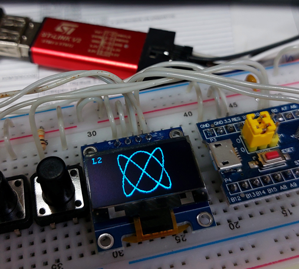

# lissajous_oled_stm32
STM32 firmware with Lissajous pattern drawing functions on the OLED display

## Compile
IDE: Keil uVision v5.29.0.0 
Toolchain: MDK-ARM Professional: 5.29.0.0

## Hardware
MCU: STM32F103C8 (with 8MHz crystal oscillator) 
Display: OLED SSD1306 128x64 
Prorgammer: ST-Link v2
